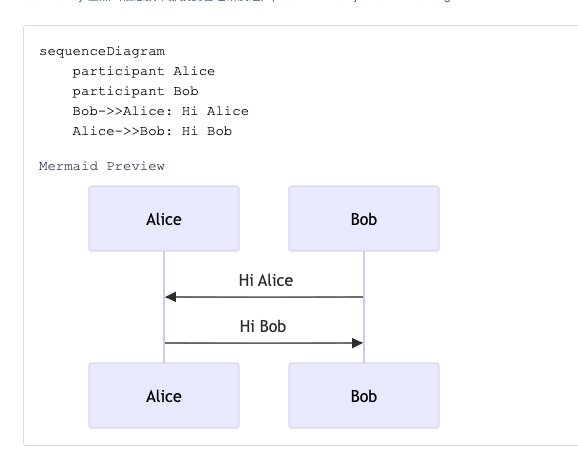
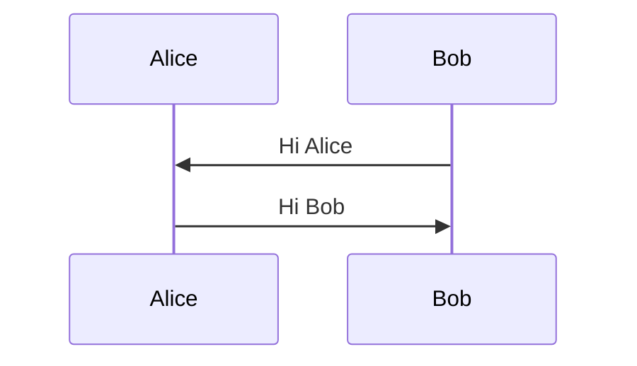
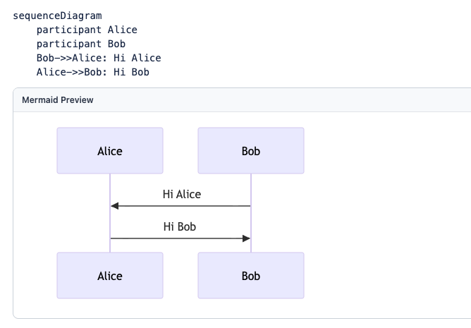

# Wiki Mermaid Preview

`Wiki Mermaid Preview` 是一个 Chrome 扩展，用来在 Wiki 页面里把 Mermaid 源码直接渲染成预览图。

它会保留原始 Mermaid 文本，并在源码下方插入一个 `Mermaid Preview` 区块，方便边写边看、边改边核对。

## 适合什么场景

- 在 Wiki / 文档系统里写 Mermaid 流程图、时序图、架构图
- 页面本身只展示源码，不会自动渲染 Mermaid
- 希望尽量少改现有写作方式，只增加预览能力

## 当前支持的两种渲染场景

### 1. Code Block，类型 `plain-text`

适合直接插入代码块、把 Mermaid 源码原样贴进去的场景。

示例内容：

```text
sequenceDiagram
  participant Alice
  participant Bob
  Bob->>Alice: Hi Alice
  Alice->>Bob: Hi Bob
```

效果示意：



### 2. Markup，类型 `markdown`，内容使用 Mermaid fenced code block

适合通过 Markdown 内容块来写 Mermaid 的场景。

示例内容：

````markdown

````

效果示意：



## 功能说明

- 保留 Mermaid 源码原文，不替换原内容
- 在源码下方自动插入预览区域
- 支持通过规则匹配不同页面结构
- 支持按站点授权，只在允许的网站上运行
- 页面内容变化后可继续扫描并补充预览

## 使用方式

1. 安装扩展后，打开扩展的 `Options` 页面。
2. 在 `Site Access` 中添加要启用的网站匹配规则，例如 `https://wiki.example.com/*`。
3. 打开目标 Wiki 页面，确认页面结构符合已启用的规则。
4. 刷新页面后，Mermaid 源码下方会出现 `Mermaid Preview`。

## 默认支持的内容结构

当前仓库内置了两类默认规则：

- 按行拆分的代码块容器
- `pre > code.language-mermaid` 这种标准 Mermaid 代码块

如果你的 Wiki 页面 DOM 结构不同，也可以在 `Options` 页面里自行调整选择器规则。

## 权限与运行方式

- 使用 `storage` 保存站点授权和选择器规则
- 使用 `scripting` 在已授权站点动态注册内容脚本
- 只会在用户明确授权的网站上运行

## 本地开发

### 安装依赖

- `npm install`

### 开发构建

- `npm run dev`

### 生产构建

- `npm run build`

### 运行测试

- `npm run test`

## 在 Chrome 中加载

1. 运行 `npm install`
2. 运行 `npm run build`
3. 打开 `chrome://extensions`
4. 打开右上角 `Developer mode`
5. 点击 `Load unpacked`
6. 选择项目里的 `dist` 目录
