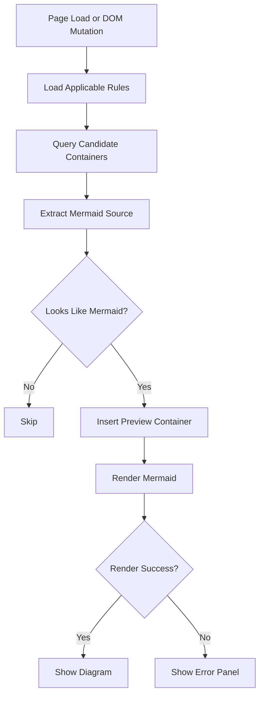

# Wiki Mermaid Preview Extension Design

## Summary

Build a Chrome Manifest V3 extension for a legacy internal wiki host such as `http://internal.example/*` that detects Mermaid source blocks on Confluence-style wiki pages, preserves the original code block, and renders a Mermaid preview directly below it. The extension should support multiple configurable selector rules so it can handle both:

- code blocks where the full Mermaid source is contained in a single element, such as `pre > code.language-mermaid`
- code blocks where each Mermaid line is rendered as a separate child element, such as Confluence syntax highlighter markup

The first release should optimize for stable internal use rather than broad web compatibility.

## Goals

- Render Mermaid previews below matching code blocks on a legacy internal wiki host such as `http://internal.example/*`
- Preserve the original code block exactly as-is
- Support user-configurable selector rules
- Support multiple extraction strategies to handle different wiki DOM shapes
- Re-scan dynamically inserted page content
- Fail safely without breaking the host page when parsing or rendering fails

## Non-Goals

- Export SVG or PNG
- Copy image to clipboard
- Visual selector recorder
- Generic support for arbitrary websites outside a legacy internal wiki host such as `http://internal.example/*`
- Write Mermaid content back into the wiki editor
- Theme customization beyond a readable default embedded style

## User Experience

When a wiki page loads, the extension scans the page for configured Mermaid candidates. If a block matches and the extracted text looks like Mermaid syntax, the extension inserts a preview panel immediately after the original code block.

The original code remains visible for comparison and troubleshooting. The preview panel shows:

- a compact header such as `Mermaid Preview`
- the rendered diagram
- a concise error message when rendering fails

The extension should also observe DOM changes so previews appear for content loaded after the initial page render.

## Architecture

The extension will be implemented as a small MV3 app with three main parts:

1. Content script
   Responsible for scanning the page, extracting Mermaid source, rendering previews, and watching for DOM mutations.
2. Options page
   Responsible for managing selector rules stored in extension storage.
3. Shared rule and extraction logic
   Responsible for validating rule objects, matching page URLs, extracting Mermaid text, and identifying likely Mermaid content.

This design intentionally avoids background-driven dynamic content script registration. A static content script with narrow host permissions is simpler and easier to reason about for an internal-only extension.

## Permissions

- `host_permissions`: `http://internal.example/*`
- `permissions`: `storage`

No download, active tab, scripting, or broad all-sites permissions are needed for the first release.

## Rule Model

Rules are stored in `chrome.storage.sync` and represented as:

```ts
type ExtractMode = "auto" | "innerText" | "joinChildrenText"

type SelectorRule = {
  id: string
  name: string
  enabled: boolean
  urlPatterns: string[]
  containerSelector: string
  extractMode: ExtractMode
  lineSelector?: string
  trimLines: boolean
  removeEmptyLines: boolean
}
```

### Field Intent

- `id`: stable identifier for updates and deduplication
- `name`: human-readable label in the options UI
- `enabled`: allows temporarily disabling a rule without deleting it
- `urlPatterns`: one or more Chrome match patterns, typically `http://internal.example/*`
- `containerSelector`: selector used to find candidate code containers
- `extractMode`: determines how source text is reconstructed
- `lineSelector`: child selector used by `joinChildrenText` and optionally `auto`
- `trimLines`: trims leading and trailing whitespace per line before joining
- `removeEmptyLines`: removes blank lines after normalization

## Extraction Modes

### `innerText`

Use the target container's `innerText` as the Mermaid source. This fits blocks like:

```css
pre > code.language-mermaid
```

### `joinChildrenText`

Query `lineSelector` under the container, read each child element's `innerText`, normalize each line, and join with `\n`. This fits Confluence-like line-by-line markup such as:

```css
div.code[data-macro-name="code"] td.code > div.container
```

with:

```css
.line
```

### `auto`

Recommended default. Behavior:

1. If `lineSelector` is provided and matching children exist, use `joinChildrenText`
2. Otherwise fall back to `innerText`

This mode keeps configuration lighter while still supporting both known wiki structures.

## Mermaid Detection

The content script should not attempt to render every matched block. After extraction, it should check whether the normalized content appears to begin with Mermaid syntax.

Initial supported keywords:

- `graph`
- `flowchart`
- `sequenceDiagram`
- `classDiagram`
- `stateDiagram`
- `stateDiagram-v2`
- `erDiagram`
- `journey`
- `gantt`
- `pie`
- `mindmap`
- `timeline`
- `gitGraph`
- `kanban`
- `architecture-beta`

Detection should allow leading whitespace but should otherwise expect Mermaid syntax near the beginning of the extracted content.

## Content Script Behavior

### Initial Scan

On page load:

1. Load rules from storage, merging user rules with built-in defaults
2. Filter rules by current URL and `enabled`
3. Query candidates for each rule
4. Extract source text from each candidate
5. If the text looks like Mermaid, render a preview below the original block

### Mutation Handling

Use `MutationObserver` on `document.body` to detect added nodes. Debounce re-scan work to avoid rendering storms on heavily dynamic pages.

When scanning added subtrees:

- only process newly added nodes and their descendants when feasible
- skip nodes already marked as handled
- keep rendering idempotent

### Duplicate Prevention

Each processed source container should receive an extension-owned attribute such as:

```html
data-wiki-mermaid-preview-processed="true"
```

The inserted preview wrapper should also carry a predictable class or attribute so it can be skipped on later scans.

## Rendering Strategy

Use the Mermaid runtime in the content script and render into a dedicated preview container inserted with `Element.insertAdjacentElement("afterend", ...)`.

Suggested structure:

```html
<div class="wmp-preview">
  <div class="wmp-preview__header">Mermaid Preview</div>
  <div class="wmp-preview__body"></div>
</div>
```

### Error Handling

If Mermaid rendering fails:

- keep the original code block untouched
- show a readable error box in the preview body
- include enough detail to help troubleshoot syntax issues without dumping large stack traces into the page
- log the full error to the browser console with an extension prefix

## Options Page

The options page should be intentionally simple. It should allow:

- listing all rules
- adding a rule
- editing a rule
- deleting a rule
- enabling or disabling a rule
- resetting built-in defaults

### Editable Fields

- rule name
- enabled flag
- URL patterns
- container selector
- extract mode
- line selector
- trim lines
- remove empty lines

### Options UX Notes

- built-in rules should be visible and copyable
- users may disable built-in rules
- validation should block saving malformed required fields
- saving should immediately persist to `chrome.storage.sync`

The options page may also include a lightweight button labeled something like `Open current wiki page and refresh to apply changes`, but the first release does not need a full live page messaging workflow. A manual refresh is acceptable if it keeps implementation smaller.

## Default Built-In Rules

### Rule A: Confluence line-by-line code macro

- `name`: `Confluence line-by-line Mermaid`
- `urlPatterns`: `["http://internal.example/*"]`
- `containerSelector`: `div.code[data-macro-name="code"] td.code > div.container`
- `extractMode`: `auto`
- `lineSelector`: `.line`
- `trimLines`: `true`
- `removeEmptyLines`: `false`

### Rule B: Standard code tag Mermaid block

- `name`: `Code tag Mermaid block`
- `urlPatterns`: `["http://internal.example/*"]`
- `containerSelector`: `pre > code.language-mermaid`
- `extractMode`: `innerText`
- `trimLines`: `false`
- `removeEmptyLines`: `false`

## Styling

Embed a small CSS file with scoped class names, for example prefixing everything with `wmp-`.

Style goals:

- visually separated from the wiki content but not distracting
- readable on the current wiki theme
- horizontally scrollable when diagrams are wide
- no global CSS leakage into the host page

The first release should prefer isolation through narrowly scoped class names instead of a Shadow DOM layer unless page style collisions prove severe during testing.

## Data Flow



## Testing Strategy

### Manual Verification

Validate at least:

- Confluence line-by-line Mermaid blocks render correctly
- `pre > code.language-mermaid` blocks render correctly
- non-Mermaid code blocks are ignored
- malformed Mermaid shows an error panel without breaking the page
- previews still appear for dynamically inserted wiki content
- disabling a rule stops rendering for that rule after refresh

### Automated Tests

Recommended first automated coverage:

- pure unit tests for extraction functions
- unit tests for Mermaid detection
- unit tests for rule filtering by URL
- lightweight DOM tests for duplicate prevention and preview insertion

Browser-level end-to-end automation is useful later, but not required for the first implementation pass.

## Risks And Mitigations

### Risk: wiki markup varies more than expected

Mitigation:

- support multiple rules from day one
- support `auto` extraction mode
- keep options UI editable

### Risk: page re-renders cause duplicate previews

Mitigation:

- mark processed source nodes
- make scans idempotent
- scope mutation handling to added subtrees

### Risk: Mermaid runtime conflicts with host page styles

Mitigation:

- use prefixed preview classes
- keep preview container styling self-contained
- consider Shadow DOM only if testing shows real collisions

### Risk: extraction from line-by-line markup includes unwanted blank or whitespace-only lines

Mitigation:

- expose `trimLines` and `removeEmptyLines`
- normalize line joins in shared extraction code

## Implementation Notes

Recommended stack:

- TypeScript
- Chrome Manifest V3
- small build setup with Vite or Plasmo

For this project, Vite plus the Chrome extension plugin is likely the cleaner fit because the extension is small and purpose-built. Plasmo remains acceptable if it speeds up development, but the design does not depend on it.

## Recommendation

Implement this as a new dedicated extension that borrows Mermaid rendering ideas from `zephyraft/mermaid-previewer` where useful, but does not fork or inherit its broader architecture. This keeps the codebase focused on the internal wiki use case while preserving room to grow rule support over time.
